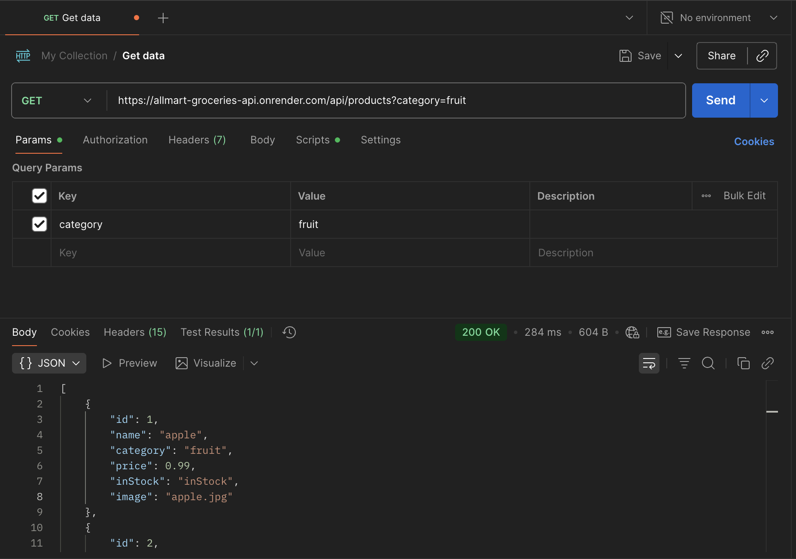

# AllMart Grocery Store API Project

## Objective
The goal of this project is to simulate a grocery store API using JSON and JavaScript.

## Purpose
This project demonstrates:

- How to fetch data, handle errors, and display products dynamically.
- Implementing basic features like search, category filtering, and voice search for accessibility.
- Combining a backend API with a responsive frontend to create a complete application.

After viewing similar websites online, I noticed their search feature doesn't offer voice search functionality (which is surprising). Hence, I incorporated the browser SpeechRecognition API to provide better accessibility.

## Tech Stack
Backend: 
- [Node.js](https://nodejs.org/en): To run the server and handle requests.
- [Express](https://expressjs.com/): For handling the API endpoints.
- [CORS](https://expressjs.com/en/resources/middleware/cors.html): To enable others to access the API.
- [Render](https://render.com/): To host the API.

Frontend:
- HTML: For structuring the UI.
- [Tailwindcss](https://v3.tailwindcss.com/): For modern, responsive styling.
- [Flowbite](https://flowbite.com/): Customizable components.
- JavaScript: For dynamic functionality and API integration.
- JSON: For storing product data.

## Backend: Node.js, Express, and CORS

The backend server is built using Node.js and Express, with CORS middleware to allow cross-origin requests. The API is hosted on [Render](https://render.com/), making it publicly accessible.

**Server Setup:**
```js
/*Import required modules*/
// Import express module to create server
const express = require('express');
// Import cors module so users access the API
const cors = require('cors');
// Import fs module to read files to read products data
const fs = require('fs');
// Import products data from JSON file
const products = require('./products.json');
// Import path module to handle file paths
const path = require('path');
// Import and configure dotenv to manage environment variables
require('dotenv').config();

// Initialize express app
const app = express();

/* Middleware */
// Enable CORS for all routes
app.use(cors());
// Parse incoming JSON requests
app.use(express.json());

// Serve static files from the 'images' directory
app.use(express.static(path.join(__dirname, 'images')));

// Serve the API documentation
app.get('/', (req, res) => {
    res.sendFile(path.join(__dirname, './api-docs.html'));
});

// Get products
app.get('/api/products', (req, res) => {
    // Get destructure query parameters
    const { category, name, id } = req.query;

    /* Filter products based on query parameters*/
    // Get all products
    let data = products;

    if (id) {
        data = data.filter(p => p.id === parseInt(id, 10));
    }

    // Filter by category
    if (category) {
        data = data.filter(p => p.category.toLowerCase() === category.toLowerCase());
    }

    // Filter by name
    if (name) {
        data = data.filter(p => p.name.toLowerCase() === name.toLowerCase());
    }  

    // Check if data array has products
    if (data.length > 0) {
        // Return the filtered products
        res.json(data);
    } else {
        // Return a 404 error if no products found
        res.status(404).json({ error: 'No products found.' });
    }
});

// Start the server
const port = process.env.PORT || 3000;

// Listen for incoming requests
app.listen(port, () => console.log(`Server is running at port ${port}`));
```

### API Endpoints
```
GET /api/products - Fetch all products

GET /api/products?category=fruit - Filter products by category

GET /api/products?name=apple - Filter products by name

GET /api/products?id=1 - Fetch a product by its unique ID
```

### Query Parameters
```
category - Filter products by category (e.g., ?category=fruit)
name - Filter products by name (e.g., ?name=apple)
id - Filter products by ID (e.g., ?id=1)
```

### Testing
**Testing with Axios:**
```js
import axios from 'axios';
import { API_LINK } from "./config.js";

async function testAPI() {
    try {
        const res = await axios.get(`${API_LINK}/api/products?category=fruit`);
        console.log("Data from API:", res.data);
    } catch (err) {
        console.error("Error:", err.message);
    }
}

setTimeout(testAPI, 2000);
```
---

**Testing with Postman:**



---
**Testing Process:**
- The script checks if the API is reachable and returns the expected data.
- It can be expanded to test different endpoints and error cases.

## Frontend Process
I created the site's structure with HTML and used both the [Tailwindcss](https://v3.tailwindcss.com/) & [Flowbite](https://flowbite.com/) frameworks to add modern styles and components.

An array of products including name, category, price, stock status, and image was created in a JSON file.

I fetched each product asynchronously using an `async` function. In case of any network issues or file damage, I wrapped the code in a `try...catch` block. This way I can catch any possible errors and display to the user.

```js
async function fetchData() {
    try {
        const response = await fetch(API_LINK + '/api/products');
        if (!response.ok) {
            throw new Error(`HTTP error: ${response.status}`)
        };
        const data = await response.json();
        return data;
    } catch (error) {
        groceryContainer.innerHTML = `
            <p class="capitalize text-gray-500">Could not fetch data: ${error.message}</p>
        `;
        return [];
    }
}
```

For the search functionality, I used the `.filter()` array method to find the matching product in the array from the fetched data.

 Initially, I tried using the `.forEach()` method with an `if` statement inside but I noticed that even when the product was found and the function was set to return, it actually continued to the `else` condition. 
 
 After doing some research I discovered that the `.forEach()` doesn't stop iterating until it has gone through all the elements from the array. I used the `.filter()` method instead, which is a simpler approach and provides cleaner code.

